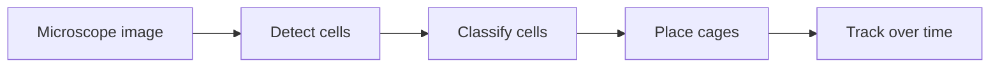

# CellCage-Sim

A real-time simulation of the image-guided cell-caging pipeline: detect cells in a microscope image, identify the targets, place isolation cages around them under geometric constraints, and track them across frames.


---

## Contents

- [Overview](#overview)
- [The problem](#the-problem)
- [Pipeline](#pipeline)
  - [1. Detect](#1-detect)
  - [2. Classify](#2-classify)
  - [3. Place cages](#3-place-cages)
  - [4. Track](#4-track)
- [Data and training](#data-and-training)
- [Validation](#validation)
- [Demo](#demo)
- [Tech stack and how to run](#tech-stack-and-how-to-run)
- [Roadmap](#roadmap)

---

## Overview

An image-guided single-cell instrument scans cells on a plate, selects the cells of interest, and forms a physical cage around each one so it can be studied in isolation. The software behind it has to decide, from each image and in real time, where those cages go.

CellCage-Sim reproduces that decision pipeline end to end. It runs four stages: (1) **detect** the cells, (2) **classify** them to find the targets, (3) **place** the cages, and (4) **track** the cells over time. The cage-placement stage is the core of the project. It is a constrained-optimization and computational-geometry problem; detection, classification, and tracking exist to feed and support it.

---

## The problem

The central task can be stated in one line:

> Given a microscope image of cells, place the maximum number of valid cages over the cells of interest, in real time, without violating the instrument's geometric constraints.

The geometric constraints come from the instrument itself: every cage is a fixed size and shape, cages cannot overlap, a cage must sit a safe distance around the cell it holds, and it must not trap a neighboring cell it was not meant to. Section 3 states each of these precisely.

Solving it spans three kinds of work:

1. **Computer vision:** find the cells and identify which ones are targets.
2. **Optimization and geometry:** decide where the cages go.
3. **Estimation:** keep track of each cell as it moves between frames.

---

## Pipeline



| Stage | What it does | Method |
|---|---|---|
| **1. Detect** | Find and outline every cell in the image | Segmentation model |
| **2. Classify** | Identify what each cell is, and flag the targets | DINOv2 + lightweight head |
| **3. Place cages** | Decide where the cages go (the core) | Constrained optimization + geometry |
| **4. Track** | Keep each cell's identity stable across frames | Kalman filter + assignment |

Model training for these stages uses the datasets in [Data and training](#data-and-training).

---

## 1. Detect

**Goal:** turn a raw microscope image into a clean, numbered list of the individual cells in it, each with its location and outline.

**The challenge:** a computer does not see "cells," only a grid of light and dark pixels. Two things make it hard:

- cells frequently **touch or overlap**, so they have to be told apart instead of merged into one blob;
- cells come in **irregular shapes**, so the method cannot assume they are neat circles.

On top of that it has to be **fast**, because the instrument runs in real time.

**Approaches considered:**

| Approach | How it works | Why it fits, or does not |
|---|---|---|
| Plain "cell vs. background" mask, then watershed | Labels each pixel as cell or not, giving blobs, then a geometric rule tries to cut the blobs apart afterward | Touching cells merge into one blob, and the after-the-fact cuts often land in the wrong place, so the count is unreliable |
| StarDist | Draws each cell by shooting rays outward from its center, assuming the whole outline is visible from the middle | Good for round cells, but ours are often long or irregular, where that shape assumption breaks down |
| Mask R-CNN | Puts a box around each cell first, then fills in the outline inside the box | Fine when cells are spread out; in crowded fields the boxes pile onto each other and it starts missing or merging cells |
| Segment Anything (SAM) | A large, general model that can outline almost anything, but you must point it at each object one at a time, and it is slow | Impractical to point at hundreds of cells per image, and too heavy for a real-time budget |
| **Cellpose-style flow U-Net (our choice)** | For every pixel it predicts an arrow pointing toward the center of that pixel's own cell; all the pixels whose arrows lead to the same center are one cell | Separates touching cells (their pixels flow to different centers) and handles any shape, while staying fast |

**Our choice.** A flow-based U-Net in the style of Cellpose. It is the only approach that separates touching cells and handles irregular shapes without a manual hint for each one: even where two cells press together, the pixels on each side point to different centers, so the boundary between them emerges on its own.

**Output:** the model first produces an image in which every pixel is stamped with the ID of the cell it belongs to. That image is then reduced to a simple list, one row per cell:

```
cell = { id, center (x, y), outline, size }
```

This list is Detect's output. The original image is kept alongside it, so a cell's pixels can be pulled back out later using its recorded location.

---

## 2. Classify

Detection found *where* the cells are. This stage decides *what each one is*, so the system knows which cells are targets to cage and which to leave alone (for example, picking out one cell type from a mixed population). It has two parts: turn each cell into a form the computer can compare, then make the call.

### Representation: a fingerprint for each cell

Before cells can be told apart, each one has to become something a computer can compare. Using each cell's location from Detect, its patch is cropped from the original image and passed through a model that turns that small picture into a list of numbers, a **fingerprint**, arranged so that cells which look alike get similar numbers.

What the model has to give us:

- fingerprints that capture how a cell actually looks, so similar cells land close together;
- good results on microscope images, not just everyday photos;
- no reliance on a large labeled dataset, so a new cell type can be recognized from only a few examples.

| Model | How it works | Why it fits, or does not |
|---|---|---|
| CNN trained from scratch | Build a fresh network and train it only on your own labeled cells | Needs thousands of labeled cells per type, which we do not have, and it recognizes only the types it was trained on |
| ImageNet ResNet-50 | Reuse a network already trained on everyday objects, reading its internal features as the fingerprint | Features learned from ordinary photos carry over only weakly to grey microscope images, so the fingerprints are mediocre for cells |
| CLIP | A model trained to match photos with their text captions | Lining images up with words does nothing to separate cell types, and it never saw microscopy |
| SAM image encoder | The vision half of a "cut anything out" model, tuned to find object outlines | Captures shape and edges (useful for *where* a cell is, which Detect already did), not *what* a cell is, and it is heavy |
| Geneformer / scGPT | Models that read a cell's gene-expression readout, not its picture | Wrong input entirely; relevant only to the future multimodal extension |
| **DINOv2 (our choice)** | A model that taught itself to describe images by studying a huge collection of them, with no labels at all | Produces rich fingerprints that carry over to microscopy, and needs no labels to do so |

**Our choice.** DINOv2, used as-is. Because it already produces strong fingerprints, we never retrain it: we keep it fixed and read the fingerprints straight out. That is what lets the stage work from few labels, since all the heavy lifting already sits inside DINOv2, and recognizing a new cell type only takes a handful of examples for the small step that follows.

### Classifier: making the call

With every cell now a fingerprint, the last step is the decision itself: given a fingerprint, output a label. Because the fingerprints already do the hard work, this step can stay simple.

We use a **linear classifier** (a linear probe): it learns a single boundary that separates one group of fingerprints from another, target versus non-target, or one cell type versus another. It needs very few examples, trains in seconds, and will not overfit. When a brand-new type shows up with only a few examples, we instead label a cell by the closest average fingerprint per type (a nearest-class-mean, or prototypical, classifier), which needs no training at all.

Heavier options do not earn their keep here: a small neural-network head overfits when labels are scarce, nearest-neighbor lookups are slower and more sensitive to noise, and an SVM works but buys nothing over the linear boundary.

### Optional fine-tune

Everything so far leaves DINOv2 untouched. If enough labeled cells become available, accuracy can be pushed further by adjusting DINOv2 itself, but that has to be done without wrecking the general fingerprints that made few labels enough in the first place. The ways to do it:

| Approach | What it changes | Trade-off |
|---|---|---|
| Full fine-tune | Retrains all of DINOv2 | Needs a lot of labels and can erase the general fingerprints, the very thing that made few examples enough |
| Linear probe only | Leaves DINOv2 fixed, trains only the final decision step | Simplest and safe, but leaves some accuracy unclaimed |
| Other add-on methods (adapters, prompt-tuning) | Insert a small trainable module into DINOv2 | Work about as well, with less standard and less well-supported tooling |
| **LoRA (our choice)** | Keeps DINOv2 frozen and trains a few tiny adjustment matrices inside it, under 1% of the model | Recovers most of the accuracy of a full retrain while keeping the base intact and fitting on a laptop |

**Our choice.** LoRA, used only when warranted. DINOv2 stays frozen by default; once enough labeled cells are available to justify adjusting the model at all, LoRA lifts accuracy without disturbing the fingerprints underneath.

**Output:** the same list of cells, each now tagged **target** or **non-target**.

---

## 3. Place cages

Stage 3 takes the labeled cells from Classify and decides where the cages go. What follows builds up to the algorithm, through why the placement is hard, what makes a cage valid, and the approaches weighed, then closes with two properties the instrument needs from it: cage shape and speed.

### Why it is hard

The obvious idea, dropping a cage on every target, does not work. A cage has real size and walls, so two targets sitting close together cannot both be caged: their walls would collide. And a cage placed around one target can accidentally enclose a non-target cell next to it. Not every target can be caged, so the job is to cage **as many targets as possible** while keeping every cage valid.

### What makes a placement valid

A cage is valid when it satisfies three rules:

1. **It holds its target.** The target cell, plus a little clearance, fits inside the wall. For a circular cage of radius `r` and wall `w` around a cell of radius `ρ` with clearance `δ`, the cage center must lie within `r - w - ρ - δ` of the cell center.
2. **It traps no outsider.** No non-target cell lies inside the cage. A non-target `n` of radius `ρ_n` stays clear when the cage center is at least `r + ρ_n + ε` away, with `ε` a safety margin.
3. **It does not collide.** No two cages overlap; two circular cages clear each other when their centers are at least `2r` apart.

Each cage holds a single target. The instrument can also co-cage an interacting pair on purpose, for example a T cell together with a cancer cell; then the target is the pair, a single cage must hold both, and the same three rules apply unchanged.

### Approaches considered

| Approach | How it works | Why it fits, or does not |
|---|---|---|
| Cage every target on its own | Drop a cage on each target, ignoring the neighbors | Fast, but neighboring cages collide and some enclose the wrong cell, so many placements come out invalid |
| Exact optimization | Ask an integer-program solver for the provably largest valid set | Gives the best possible answer, but is slow on a live field and more machinery than the small accuracy gain is worth |
| **Geometric optimization (our choice)** | For each target, compute the region where a cage can legally sit and place it at the most robust point; then keep the largest non-overlapping set, solved exactly on small clusters and near-optimally on large ones | Near-optimal, copes with crowding and with uncertain cell outlines, and stays inside the real-time budget |

**Our choice.** A two-step geometric optimizer. First, for each target, compute where a cage can legally sit and place it at the most robust point. Then keep the largest non-overlapping set, which is a maximum independent set problem: NP-hard in general, but the plate's geometry lets us solve it exactly on small clusters and near-optimally on the rest.

### The algorithm

**Input:** the cell list from Classify (each cell's position, size, and target or non-target label) and the cage specification (shape, radius, wall thickness, clearances).

**Output:** a set of valid cage placements, each naming its center and the target it holds.

**The idea in brief.** The engine works in two passes. The first looks at each target on its own and finds the single best cage for it, ignoring the other cages. The second looks across all those cages at once and keeps the largest set that does not overlap. Reading the code:

- **lines 1 to 2** build a spatial index, so each cell finds its neighbors without scanning the whole plate, and an empty candidate list;
- **lines 4 to 6** build the target's *legal region*. A target is one cell, or a small group to co-cage such as an interacting T cell and cancer cell. Start from the centers that enclose the whole target (a disk for one cell, the overlap of one disk per cell for a group), then subtract a disk around each nearby non-target the cage must not trap. A cell the classifier is only unsure is a non-target subtracts a wider disk, so the engine hedges on doubtful cells;
- **lines 7 to 8** skip the target when nothing is left, since it cannot be caged without breaking a rule;
- **line 9** places the cage at the point with the most clearance to every edge of the region, its *Chebyshev center* (the middle of the largest circle that fits), so a small error in the detected outline cannot push a cell in or out;
- **line 11** groups overlapping cages into clusters, the connected components of the overlap graph, found quickly with union-find;
- **lines 13 to 15** keep, in each cluster, the largest set of cages with no two overlapping; that set is what *maximum independent set* means. A cluster counts as *small* when it holds few enough cages, a fixed threshold of around a dozen, to search exactly: branch and bound tries the combinations and returns the largest valid set. A rare larger cluster is handled *greedily*, meaning it repeatedly adds the cage that overlaps the fewest others and skips any that clash with one already kept; a *local search* then swaps a kept cage for two it was blocking whenever that raises the count;
- **line 16** returns the cages that survived.

```
PlaceCages(cells, cageSpec) returns chosen

Part 1: find the best legal cage for each target
 1  index      <- spatial index over all cell positions
 2  candidates <- empty list
 3  for each target t (one cell, or a group to co-cage):
 4      allowed <- centers whose cage encloses every cell of t  # enclosure
 5      for each non-target n near t (from the index):
 6          allowed <- allowed minus centers that would trap n  # exclusion
 7      if allowed is empty:                                    # t cannot be caged
 8          continue
 9      x <- point in allowed with the most clearance           # Chebyshev center
10      candidates.add( cage(center x, holds t) )

Part 2: keep the largest set of cages with no overlaps
11  clusters <- connected groups of overlapping cages           # connected components
12  chosen <- empty list
13  for each cluster K:
14      if K is small:  chosen += exact_MIS(K)                  # branch and bound
15      else:           chosen += greedy_then_local_search(K)    # greedy + local search
16  return chosen
```

### Cage shape

This project targets fixed-shape cages: a **circle** or a **hexagon**, each defined by an outer radius `r` and a wall thickness `w`. Shape enters the algorithm only through its geometry: enclosing a target, excluding a non-target, and overlapping another cage. For circles these are distance comparisons; for hexagons, point-in-polygon and edge-distance tests. Nothing else changes, so switching between the two is a configuration setting, not a rewrite.

The instrument can also form Voronoi-style enclosures, whose walls are shared between neighbors instead of drawn as fixed shapes. That is a different formulation and is out of scope here.

### Speed

Cost tracks local crowding, not the total cell count. The spatial index means each target only looks at its nearby cells, both when building its legal region and when finding overlaps, and the independent clusters keep the exact solve small. A dense patch costs a little more than a sparse one, but no step ever scans the whole plate, so a field is handled in close to linear time, well inside the instrument's millisecond budget. The geometry is simple arithmetic that moves cleanly onto a compiled path (Numba or a small C++ core), and every run reports its latency and peak memory.

**Output:** the set of valid cage placements for the field.

---

## 4. Track

Cages are imaged over time, and each cell drifts slightly between frames. Tracking keeps every cell's **identity** stable across the sequence, so the same cell can be followed from frame to frame.

### Approaches considered

| Approach | How it works | Why it fits, or does not |
|---|---|---|
| Greedy nearest match | Match each detection to the closest cell in the previous frame | Trivial, but with no prediction it swaps identities as soon as two cells pass close or one is missed for a frame |
| Overlap (IoU) matching | Link cells whose outlines overlap most between consecutive frames | Fine when cells barely move, but ours drift enough that outlines can miss frame to frame, and it still ignores velocity |
| Appearance re-identification | Learn a look-based embedding per cell and match on appearance across frames | Strong for people or cars, but cells look nearly identical, so appearance adds little while costing training and compute the live budget cannot spare |
| Particle filter | Track each cell with a cloud of weighted samples, for nonlinear, non-Gaussian motion | More general than a Kalman filter, but cell drift is close to linear, so the extra cost buys nothing here |
| Global (offline) association | Optimize all frame-to-frame links at once over the whole sequence | Most accurate, but it needs the entire video up front, so it cannot run live with the instrument |
| **Kalman filter + Hungarian (our choice)** | Predict each cell's next position from its motion, then match predictions to detections with an optimal one-to-one assignment | Online and fast, survives crossings and brief misses because it matches on prediction, and cell motion is near-linear, the Kalman filter's sweet spot |

**Our choice.** A Kalman filter for prediction paired with Hungarian assignment for matching, the standard online tracking-by-detection approach. It runs live frame by frame, needs no training, and fits cell motion well, which stays close to linear between frames.

### The algorithm

**Input:** the cells detected in each frame (from stage 1), in order.

**Output:** a stable identity for every cell, held consistent across all frames.

**The idea in brief.** Each tracked cell carries a small motion model that predicts where it will appear next, and every new frame is matched against those predictions rather than the last-seen positions, which is what keeps identities straight when cells drift or pass close together. A *detection* is a cell found in the current frame; a *track* is an ongoing cell identity. Reading the code:

- **line 1** starts with no tracks; each track created later is a cell identity plus its motion model;
- **lines 3 to 4** predict where each existing cell should appear in this frame. The motion model is a *Kalman filter*: it keeps each cell's position and velocity, predicts the next position from them, then corrects itself with the new measurement. Velocity is never measured directly; the filter infers it from how a cell's position shifts across frames;
- **lines 5 to 6** score each track's prediction against each detection by distance, skipping any pair beyond a set *gating* radius so distant cells are never matched;
- **line 7** pairs predictions to detections with a *Hungarian assignment*, the one-to-one matching with the smallest total distance;
- **lines 8 to 9** feed each matched detection back into its Kalman filter to sharpen the next prediction;
- **lines 10 to 11** open a new track for any unmatched detection (a cell entering the field) and retire any track unmatched for more than a few frames (a cell that has left or died);
- **line 12** returns each cell's identity across the sequence.

```
Track(frames) returns identities

 1  tracks <- empty list                        # each track = a cell id + its Kalman filter
 2  for each frame, in order:
 3      for each track:
 4          track.predicted <- track.predict()   # Kalman filter's guess from position and velocity
 5      for each track, detection pair within the gating radius:
 6          cost[track][detection] <- distance(track.predicted, detection)
 7      matches <- Hungarian(cost)               # min-total-distance one-to-one match
 8      for each matched (track, detection):
 9          track.update(detection)              # correct the filter with the measurement
10      start a new track for each unmatched detection
11      retire any track unmatched for more than a few frames
12  return the identities of all tracks
```

---

## Data and training

| Dataset | Used for | Scale | Links |
|---|---|---|---|
| **LIVECell** | Training detection and classification | 5,000+ phase-contrast images, 1.6M+ annotated cells | [dataset](https://sartorius-research.github.io/LIVECell/) · [paper](https://www.nature.com/articles/s41592-021-01249-6) |
| **Synthetic plate generator** | Ground truth for cage placement | Generated on demand, exact labels | in this repo (`data/`) |
| **Cell Tracking Challenge** | Validating tracking | Annotated time-lapse sequences | [datasets](https://celltrackingchallenge.net/datasets/) |

- **LIVECell** is the backbone of the vision stages: a large, expert-annotated microscopy dataset, so detection and classification learn from genuine cell morphology.
- **Cage placement has no public ground truth**, because no dataset ships cage annotations. We generate it: real cell shapes are composited onto a simulated plate, which makes the correct cage layout and occupancy labels known exactly. This is also how the instrument's own validation would be run.
- **Tracking** is checked both on real annotated time-lapse sequences and on synthetic drift sequences where the true trajectories are known.

---

## Validation

_The metrics below are what the project reports; each value is filled in as its stage is built._

**Accuracy**

| Component | Metric | Result |
|---|---|---|
| Detection | IoU / Dice | _TBD_ |
| Classification | Accuracy / F1 @ k-shot | _TBD_ |
| Cage placement | Target coverage %, constraint-violation rate | _TBD_ |
| Cage placement vs. baseline | Coverage uplift over a naive greedy baseline | _TBD_ |
| Tracking | ID switches, MOTA | _TBD_ |

**Performance**

| Configuration | Latency / field | Throughput | Peak memory |
|---|---|---|---|
| Cage engine, circular | _TBD_ | _TBD_ | _TBD_ |
| Cage engine, hexagonal | _TBD_ | _TBD_ | _TBD_ |
| Full pipeline (detect to cage) | _TBD_ | _TBD_ | _TBD_ |

---

## Demo

An interactive demo runs the full pipeline in the browser. Select or upload a field to see cells detected, targets labeled, cages placed (circular or hexagonal), and per-run latency. Load a short sequence to see tracking across frames.

---

## Tech stack and how to run

**Stack:** Python, PyTorch, DINOv2, NumPy/SciPy, Numba (with an optional pybind11/C++ core), scikit-image, Gradio.

```
cellcage-sim/
├── data/          # LIVECell loader + synthetic plate generator
├── detect/        # segmentation model + training
├── classify/      # DINOv2 embeddings + few-shot head + LoRA fine-tune
├── cage/          # constrained-optimization engine (circle/hexagon)
├── track/         # Kalman filter + assignment
├── bench/         # latency / throughput / memory harness
└── app/           # interactive demo
```

```bash
pip install -r requirements.txt
python -m data.make_synthetic     # build the synthetic dataset
python -m detect.train            # train the segmentation model
python -m classify.finetune       # fine-tune the DINOv2 head (LoRA)
python -m bench.run               # reproduce the performance tables
python -m app.demo                # launch the demo locally
```

---

## Roadmap

- C++ port of the cage engine for instrument-grade latency.
- Alternative formulations (integer programming, convex relaxation) benchmarked against the heuristic for quality versus speed.
- Multimodal extension linking imaging with transcriptomic embeddings.

---

_A personal project, built for the fun of it, to show how I would approach Cellanome's CellCage workflow. Public data only._
